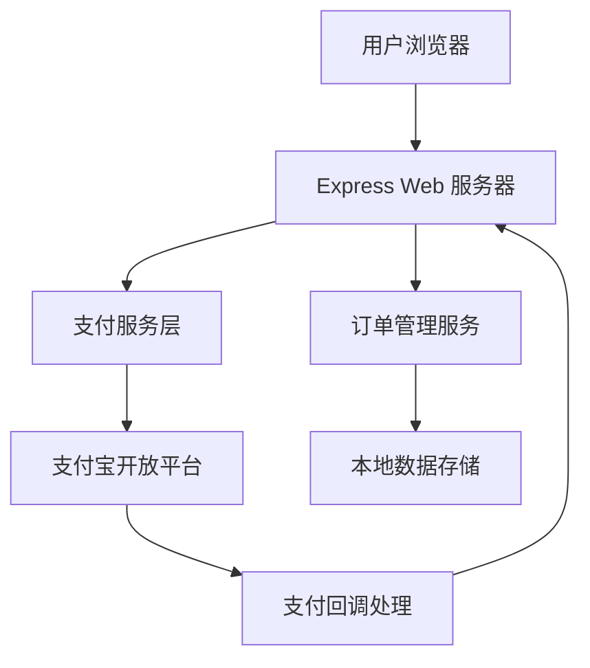

# 设计文档

## 概述

本设计文档描述了基于 Node.js 的支付宝网页支付集成方案。系统将使用 Express.js 框架构建 Web 服务，集成支付宝开放平台的 alipay.trade.page.pay 接口，实现完整的支付流程包括订单创建、支付跳转、回调处理和状态管理。

## 架构

### 系统架构图



### 技术栈
- **后端框架**: Express.js
- **支付SDK**: 官方 alipay-sdk-nodejs 或自实现签名逻辑
- **数据存储**: 内存存储（开发阶段）/ JSON 文件存储
- **模板引擎**: EJS 或 Handlebars（用于支付页面渲染）
- **环境配置**: dotenv

## 组件和接口

### 1. 支付配置管理 (PaymentConfig)

**职责**: 管理支付宝应用配置和环境切换

**接口**:
```javascript
class PaymentConfig {
  constructor(environment = 'sandbox')
  getAppId()
  getPrivateKey()
  getAlipayPublicKey()
  getGatewayUrl()
  getNotifyUrl()
  getReturnUrl()
}
```

### 2. 签名服务 (SignatureService)

**职责**: 处理支付宝接口的签名生成和验证

**接口**:
```javascript
class SignatureService {
  generateSignature(params, privateKey)
  verifySignature(params, signature, publicKey)
  sortAndConcatParams(params)
}
```

### 3. 支付服务 (PaymentService)

**职责**: 核心支付业务逻辑处理

**接口**:
```javascript
class PaymentService {
  createPayment(orderInfo)
  generatePaymentUrl(orderInfo)
  handleNotifyCallback(notifyData)
  handleReturnCallback(returnData)
  queryPaymentStatus(outTradeNo)
}
```

### 4. 订单管理 (OrderManager)

**职责**: 订单状态管理和持久化

**接口**:
```javascript
class OrderManager {
  createOrder(orderData)
  updateOrderStatus(orderId, status)
  getOrder(orderId)
  getAllOrders()
}
```

### 5. Web 路由控制器 (PaymentController)

**职责**: 处理 HTTP 请求和响应

**接口**:
```javascript
class PaymentController {
  showPaymentPage(req, res)
  initiatePayment(req, res)
  handleAlipayNotify(req, res)
  handleAlipayReturn(req, res)
  getPaymentStatus(req, res)
}
```

## 数据模型

### 订单模型 (Order)
```javascript
{
  id: String,           // 订单ID
  outTradeNo: String,   // 商户订单号
  subject: String,      // 订单标题
  totalAmount: Number,  // 支付金额
  status: String,       // 订单状态: 'pending', 'paid', 'failed', 'cancelled'
  createdAt: Date,      // 创建时间
  updatedAt: Date,      // 更新时间
  tradeNo: String,      // 支付宝交易号
  buyerLogonId: String, // 买家支付宝账号
  paymentTime: Date     // 支付完成时间
}
```

### 支付请求模型 (PaymentRequest)
```javascript
{
  outTradeNo: String,   // 商户订单号
  subject: String,      // 订单标题
  totalAmount: String,  // 支付金额（字符串格式）
  body: String,         // 订单描述
  timeoutExpress: String, // 支付超时时间
  productCode: 'FAST_INSTANT_TRADE_PAY' // 产品码（固定值）
}
```

## 错误处理

### 错误类型定义
```javascript
class PaymentError extends Error {
  constructor(code, message, details = null) {
    super(message)
    this.code = code
    this.details = details
  }
}

// 错误码定义
const ERROR_CODES = {
  INVALID_SIGNATURE: 'INVALID_SIGNATURE',
  PAYMENT_FAILED: 'PAYMENT_FAILED',
  ORDER_NOT_FOUND: 'ORDER_NOT_FOUND',
  INVALID_AMOUNT: 'INVALID_AMOUNT',
  NETWORK_ERROR: 'NETWORK_ERROR'
}
```

### 错误处理策略
1. **签名验证失败**: 记录详细日志，返回 400 状态码
2. **网络请求失败**: 实现重试机制，最多重试 3 次
3. **订单状态异常**: 记录异常日志，通知管理员
4. **参数验证失败**: 返回具体的参数错误信息

## 测试策略

### 单元测试
- **SignatureService**: 测试签名生成和验证逻辑
- **PaymentService**: 测试支付流程各个环节
- **OrderManager**: 测试订单 CRUD 操作
- **PaymentConfig**: 测试配置加载和环境切换

### 集成测试
- **支付宝沙箱集成**: 测试完整支付流程
- **回调处理**: 测试异步通知和同步返回
- **错误场景**: 测试各种异常情况的处理

### 端到端测试
- **用户支付流程**: 从订单创建到支付完成的完整流程
- **支付状态查询**: 测试支付状态的实时查询
- **多订单并发**: 测试系统在并发支付场景下的稳定性

## 安全考虑

### 1. 密钥管理
- 使用环境变量存储应用私钥和支付宝公钥
- 私钥文件权限设置为仅应用可读
- 定期轮换密钥对

### 2. 签名验证
- 所有支付宝回调必须验证签名
- 使用 RSA2 签名算法确保安全性
- 防止签名重放攻击

### 3. 数据验证
- 严格验证所有输入参数
- 金额字段使用精确的数值类型
- 防止 SQL 注入和 XSS 攻击

### 4. 网络安全
- 使用 HTTPS 协议传输敏感数据
- 设置合理的请求超时时间
- 实现请求频率限制

## 部署配置

### 环境变量配置
```bash
# 支付宝应用配置
ALIPAY_APP_ID=your_app_id
ALIPAY_PRIVATE_KEY_PATH=./keys/app_private_key.pem
ALIPAY_PUBLIC_KEY_PATH=./keys/alipay_public_key.pem

# 环境配置
NODE_ENV=development
PAYMENT_ENV=sandbox

# 服务器配置
PORT=3000
HOST=localhost

# 回调地址配置
NOTIFY_URL=http://localhost:3000/alipay/notify
RETURN_URL=http://localhost:3000/alipay/return
```

### 沙箱环境配置
- **网关地址**: https://openapi.alipaydev.com/gateway.do
- **沙箱账号**: 使用支付宝提供的测试账号
- **测试金额**: 限制在合理范围内（如 0.01-100 元）